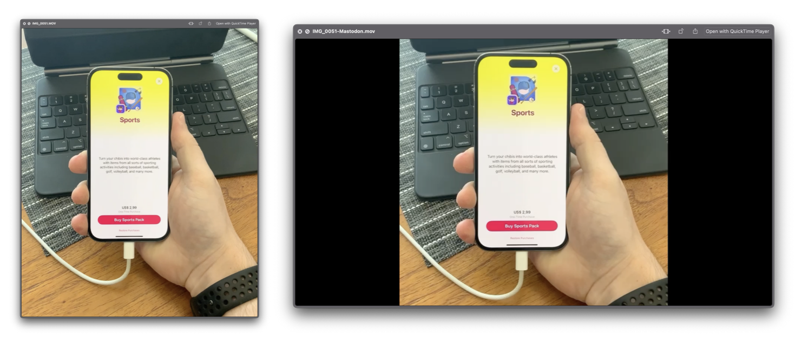

# encodeformastodon

Simple command-line tool for macOS that encodes videos in a format suitable for publishing to Mastodon. Runs on macOS 12 or later.

I wrote this tool because upon uploading [a vertical video to my Mastodon account](https://mastodon.social/@_inside/109540102047492623), I noticed that it didn't convert the video properly, resulting in a distorted video.
This tool is a temporary workaround until Mastodon gets better support for video uploads. It also serves as a simple example of how to use AVFoundation for this sort of video manipulation.

All it does is resize the video to fit in a 1920x1080 resolution, pillar-boxing if needed.

[A notarized build installer is available in the releases page](https://github.com/insidegui/encodeformastodon/releases/latest).

```
OVERVIEW: Encodes and resizes any input video in a format suitable for
publishing to Mastodon.

USAGE: encodeformastodon <path>

ARGUMENTS:
  <path>                  Path to the video file that will be encoded

OPTIONS:
  -h, --help              Show help information.
```

You can see a before/after example in the image below:

